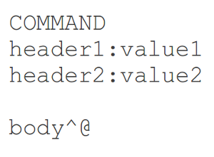

!SLIDE subsection
# Building WebSocket-Style Applications

!SLIDE small
## Using a WebSocket API directly is a bit like
## writing a __custom Servlet__ application

!SLIDE small
## Except the WebSocket protocol is
## on lower level than HTTP

!SLIDE small center
# WebSocket vs HTTP
 

!SLIDE

 <blockquote>"The basic issue is there isn't enough information in an incoming websocket message for the container to know where to route it if there are multiple methods where it may land."</blockquote>
  
Danny Coward, __JSR-356 lead__ In [response to question](https://java.net/projects/websocket-spec/lists/users/archive/2013-03/message/69) on user mailing list

!SLIDE small bullets incremental
# Using WebSocket API
## (Doable but leads to...)
  
* One WebSocket handler for entire app!
* Custom message formats
* Big if-else loop to interpret messages
* Essentially your own framework (+ client-side)

!SLIDE

<blockquote>"The subprotocol attribute of the handshake might serve as a useful place to attach this kind of message description/meta data, or some JSR356 specific headers in the handshake. Of course, the other issue is that the other end is often javascript, which would need to participate in some way in such a scheme."</blockquote>

<blockquote>"These are all things we'll likely look at in the next version."</blockquote>

From next [reply](https://java.net/projects/websocket-spec/lists/users/archive/2013-03/message/72) on same thread

!SLIDE small bullets incremental
# Sub-protocols

* WebSocket defines [sub-protocol](http://tools.ietf.org/html/rfc6455#section-1.9) mechanism
* Essentially use higher-level messaging protocol
* Either way you've to choose message format: custom, standard, or framework-specific
* ... and clients are impacted by this choice

!SLIDE small center
## Messaging Sub-protocol Examples:
 
## JMS, AMQP, XMPP, STOMP, MQTT, VNC, ...

!SLIDE small bullets incremental
# Use Message Broker?

* Actually yes, RabbitMQ, ActiveMQ, many others
* ... support sending messages over WebSocket
* directly from the browser
* RabbitMQ also supports SockJS

!SLIDE small center
# Using Message Broker

!SLIDE small bullets incremental
# Why **Do** It?

* Messaging is a hard problem
* Brokers have been doing it for a long time
* Scalale, robust, configurable, monitaring
* No need to re-invent the wheel

!SLIDE small bullets incremental
# Why **Not Do** It?

* Message brokers never been used over the web
* We already have a Web application server
* Need web framework centric programming model
* Something that feels familiar to web devs

!SLIDE small bullets incremental
# [STOMP](http://stomp.github.io/)

* Commonly supported in message brokers
* Simple messaging protocol
* Frames modelled on HTTP
* Well suited for use over the Web

!SLIDE smaller center
# STOMP Frame
 

!SLIDE smaller bullets incremental
# `"Destination"` Header

* Opaque string, syntax left to server
* Typically path-like URIs (`"/queue/a"`, `"/topic/a"`)
* Message brokers choose the semantics

!SLIDE smaller center
# Example
## Client Sends Message
 

!SLIDE smaller center
# Example
## Client Subscribes To Receive Messages
 

!SLIDE smaller center
# Example
## Client Receives Message
 

!SLIDE smaller bullets incremental
# What STOMP Gives Us...

* A message format .. _check!_
* Client library like [stomp.js](https://github.com/jmesnil/stomp-websocket) .. _check!_
* Higher-level messaging protocol .. _check!_
* Good progress everyone (0 lines of code)

!SLIDE smaller center
# STOMP Over WebSocket
## Spring Framework 4
  

!SLIDE smaller
# Example Controller

 
    @@@ java

    @Controller
    public class GreetingController {

      @MessageMapping("/greetings")
      public String greet(String greeting) {

          // Return value broadcast to "/topic/greetings"

          return "[" + getTimestamp() + "]: " + greeting;
      }

    }

!SLIDE smaller center
# The Big Picture
## with Simple Built-in Broker
  

!SLIDE smaller center
# The Big Picture
## with Message Broker
  

!SLIDE small center
# Demo
 
## [https://github.com/](https://github.com/rstoyanchev/spring-websocket-portfolio)
## [rstoyanchev/spring-websocket-portfolio](https://github.com/rstoyanchev/spring-websocket-portfolio)

