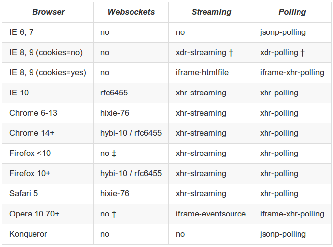

!SLIDE subsection
# WebSocket and Spring

!SLIDE small bullets incremental
# The Spring Value-Add

* Spring configured JSR-356 endpoints
* Spring WebSocket API
* Fallback options
* Higher-level messaging support

!SLIDE small bullets incremental
# Spring Config for JSR-356

* Basically use JSR-356 API
* Declare endpoints in Spring config _(skip JSR-356 container scan)_
* Singleton / per-session instance endpoint lifecycle
* Client-side auto startup mode 

!SLIDE small center
# Demo
 
## [https://github.com/rstoyanchev/](https://github.com/rstoyanchev/spring-websocket-test)
## [spring-websocket-test](https://github.com/rstoyanchev/spring-websocket-test)
 
## Switch to **"endpoint"** branch

!SLIDE small bullets incremental
# Spring WebSocket API

* Adapts to JSR-356 runtime (extends to others)
* A foundation for Spring's own use
* We view it as a low level building block
* Customizable, well-integrated with Spring MVC

!SLIDE small center
# Demo
 
## [https://github.com/rstoyanchev/](https://github.com/rstoyanchev/spring-websocket-test)
## [spring-websocket-test](https://github.com/rstoyanchev/spring-websocket-test)
 
## **"master"** branch

!SLIDE small bullets incremental
# Fallback Options

* Emulate the WebSocket API (as close as possible)
* Various transport options underneath
* For where WebSocket isn't supported (IE < 10)
* ... or is [precluded by network proxies](http://www.infoq.com/articles/Web-Sockets-Proxy-Servers)

!SLIDE small bullets incremental
# SockJS

* A lightweight [protocol](https://github.com/sockjs/sockjs-protocol) specified with [python test suite](http://sockjs.github.io/sockjs-protocol/sockjs-protocol-0.3.3.html)
* Browser JavaScript [client](https://github.com/sockjs/sockjs-client) provided
* Wide range of [server implementations](https://github.com/sockjs/sockjs-client) available
* Now also supported in `spring-websocket`

!SLIDE small center
# SockJS Transports
 

!SLIDE small bullets incremental
# Using SockJS in Spring

* A matter for configuration change
* Code remains the same
* sockjs-client in the browser
* Essential for any public facing application

!SLIDE small center
# Demo
 
## [https://github.com/](https://github.com/rstoyanchev/spring-websocket-test)
## [rstoyanchev/spring-websocket-test](https://github.com/rstoyanchev/spring-websocket-test)
 
## **"master"** branch

